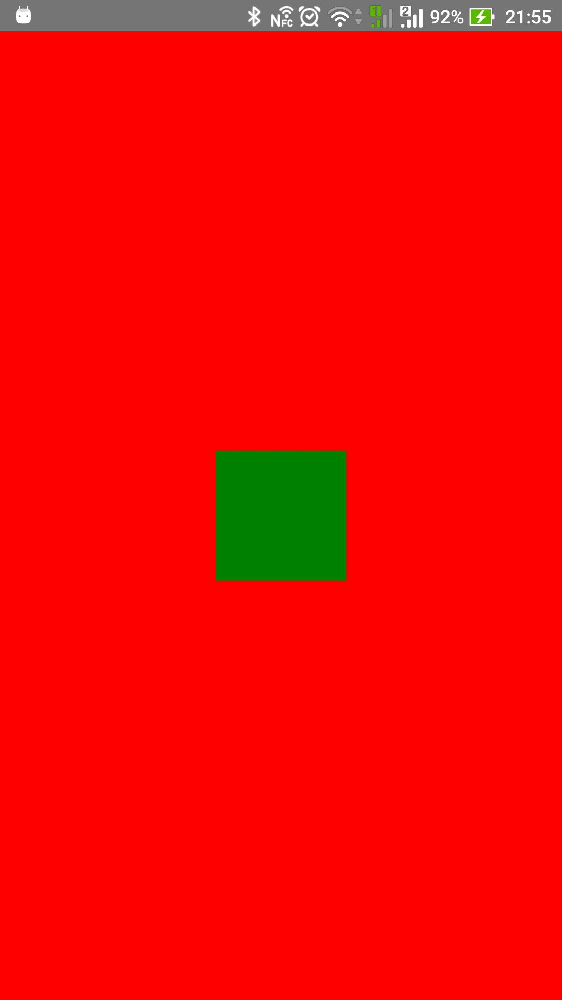
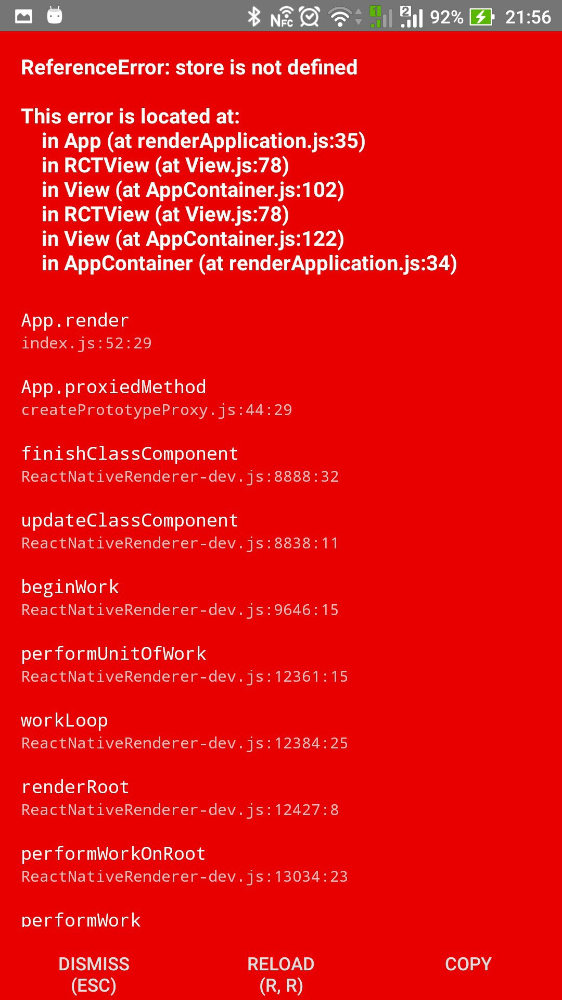
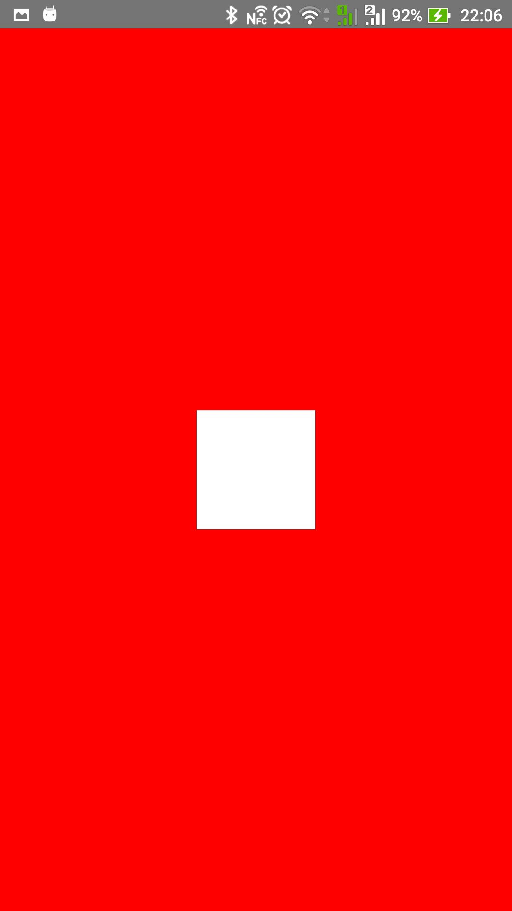

# easy-redux
Материалы для презентации по redux

# Пишем свой redux

---
# Последовательность действий
1. Создаем структуру
2. Начнем с простого - `Connect`
3. Допишем недостающие функции
4. Достаем банки - время заготовок (готовим `Provider`)
5. Набросаем тестовый пример
6. Пишем простейшие `reducer` и `initialState`. Дописываем некоторые функции
7. Заполняем `Provider` полностью
8. Работает &#128077;

---
# Структура
```
|- stateManager
   |
   |--- components
   |     |--- connect.js
   |     |--- provider.js
   |
   |--- functions
   |     |--- index.js
   |
   |--- index.js
```
```
// stateManager/index.js
export {default as Provider} from './components/provider';
export {default as connect} from './components/connect';
export {combineReducers, createStore} from './functions';
```


---
# Connect

```
const connect = (
    mapStateToProps = defaultMapStateToProps,
    mapDispatchToProps = defaultMapDispatchToProps,
) => (Child) => {
    class Connect extends React.Component {
        // ... см дальше
        getProps() {
            return {
            ...this.props,
            ...mapStateToProps(Provider.getState()), 
            ...mapDispatchToProps(Provider.dispatch)};
        }

        render() {
            return <Child {...this.getProps()} />;
        }
    }

    return Connect;
}
```


---
# Продолжение
```
class Connect extends React.Component {
    onDispatch(newState) {
        this.forceUpdate();
    }
    componentDidMount() {
        this.id = Provider.registerComponent(this);
    }
    componentWillUnmount() {
        Provider.removeComponent(this);
    }
    // ... было выше
        
};

export default connect;
```

---
# Дописываем недостающие функции
~~слишком сложно~~
```
export function defaultMapStateToProps(state) {
    return {};
}

export function defaultMapDispatchToProps(_dispatch) {
    return {dispatch: _dispatch};
}
```

---
# Provider
Нужны `static` методы (из кода компонента `Connect`):
- `getState`
- `dispatch`
- `regiterComponent`
- `removeComponent`

---
# Базовый код
```
    constructor(props) {
        super(props);
        if (!props.store) {
            throw 'Компоненту "Provider"'+
            ' необходимо передать "store"';
        }
        if (Provider._ProvidersCount != 0) {
            throw 'Можно использовать только'+
            ' один компонент "Provider"';
        }
        ++Provider._ProvidersCount;
        Provider._store = {
            reducers: props.store.reducers,
            state: props.store.initialState,
        };
    }
    render() {
        return this.props.children;
    }
```

---
# Не забываем объявить новые static поля
и еще парочку новых
```
// Число созданных Provider компонентов
    static _ProvidersCount = 0;
// store
    static _store = {};
// Список подключенных компонентов
    static _connected = {};
// id последнего подключенного компонента
    static _lastId = -1;
// теперь знаем где взять state
    static getState() {
        return Provider._store.state;
    };
```

---
# Зарегистрируем отношения
```
    static registerComponent(Connect) {
        ++Provider._lastId;
        Provider._connected[Provider._lastId] = Connect;
        return Provider._lastId;
    };

    static removeComponent(Connect) {
        delete Provider[Connect.id];
    };
```

---
# Тестовый пример
```
class Test extends Component {
    render() {
        return (
            <TouchableOpacity onPress={() => {
                this.props.dispatch({
                    type: 'SET_COLOR',
                    value: 'white',
                });
            }}>
                <View style={{
                    backgroundColor: this.props.color,
                    width: 100,
                    height: 100,
                }}/>
            </TouchableOpacity>
        );
    }
}
const ConnectedTest = connect((state) => (
    {color: state.default.color})
)(Test);

```

---
# Основной компонент
```
export default class App extends Component {
    render() {
        return (
            <Provider store={store}>
                <View style={styles.container}>
                    <ConnectedTest/>
                </View>
            </Provider>
        );
    }
}

const styles = StyleSheet.create({
    container: {
        flex: 1,
        justifyContent: 'center',
        alignItems: 'center',
        backgroundColor: 'red',
    },
});
```

---
# Ожидание и реальность
 


---
# Почему не работает?
```
// functions/index.js
export function createStore(reducers, initialState = {}){
    return {
        reducers,
        initialState,
    };
}

// app/index.js
function reducer(state, action) {
    if (action.type == 'SET_COLOR') {
        return {...state, color: action.value};
    }
    return state;
}
let store = createStore(
    {default: reducer}, {default: {color: 'green'}}
);

```

---
# Provider - `dispatch`

```
    static dispatch(action) {
        const {state, reducers} = Provider.store;
        if (Provider._ProvidersCount == 0) {
            throw 'Нет ни одного компонента "Provider"';
        }
        for (let key in reducers) {
            state[key] = reducers[key](
                    state[key],
                    action
                );
            }
        }
        for (let item in Provider._connected) {
            Provider._connected[item].onDispatch(state);
        }
    };
```

---
# Результат
 
<---клик--->

